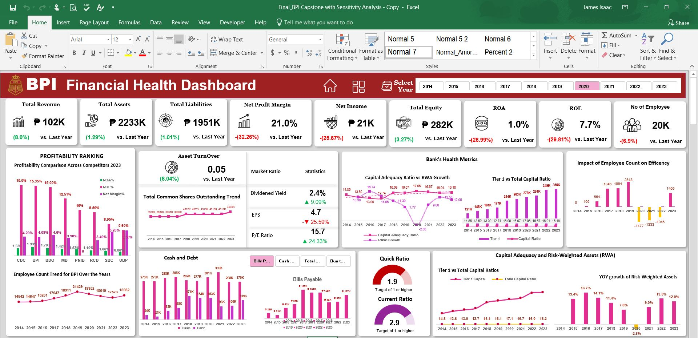
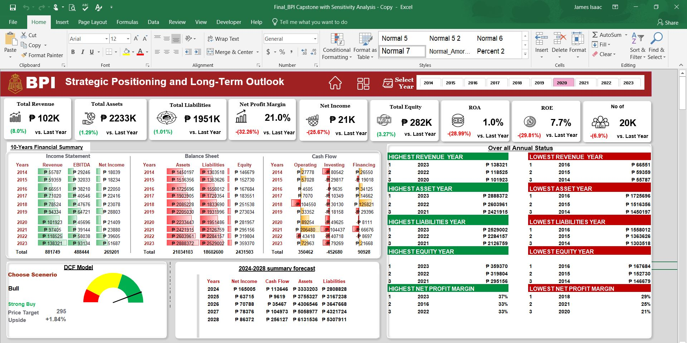

# BPI Financial Dashboard – Analyzing Financial Performance with Excel

## Introduction
This project was developed for BPI Bank as a freelance project, where I created an interactive financial dashboard to analyze key performance indicators such as revenue, profit margins, assets, liabilities, and market ratios. The dataset was provided by BPI, and my goal was to transform raw financial data into meaningful, easy-to-understand insights for decision-makers.

With this dashboard, stakeholders can track financial trends over a 10-year period, assess the bank’s market performance, and make data-driven strategic decisions.

## Excel Concepts Applied
To build this dashboard, I used various Excel techniques and tools to ensure accuracy, automation, and interactivity:
- Power Query ⚡ – For data cleaning, transformation, and structuring.
- Pivot Tables & Pivot Charts 📊 – For dynamic data analysis and visualization.
- Conditional Formatting 🎨 – To highlight trends, variances, and key financial metrics.
- Data Validation & Dropdowns ✅ – For interactive filters (e.g., year selection).
- Formulas & Functions 🧮
- LOOKUP functions (VLOOKUP, INDEX-MATCH) – To fetch relevant financial data.
- IF & Nested IFs – For logical comparisons and conditional reporting.
- SUMIFS, AVERAGEIFS – For category-based financial aggregations.
- Financial Modeling (DCF Analysis) 📉 – For valuation and future growth forecasting.
These Excel techniques ensured efficiency, accuracy, and interactivity, making the dashboard user-friendly and insightful.

## About the Dataset
The dataset was provided by BPI Bank and contains 10 years of financial data (2014-2023), covering:
- Income Statement – Revenue, EBITDA, net income, and profit margins.
- Balance Sheet – Assets, liabilities, and equity trends.
- Cash Flow – Operating, investing, and financing cash flows.
- Market Ratios – ROA, ROE, EPS, and P/E ratio.
- Risk & Capital Metrics – Capital adequacy ratio, risk-weighted assets, and tier-1 capital.
- This data was cleaned, structured, and visualized to highlight trends, comparisons, and financial performance insights.

## Insights from the Dashboard
The dashboard provides a clear, visual breakdown of BPI’s financial health. Here are some key insights:

- **Revenue & Profit Trends:** 
Revenue has grown by 8% YoY, but net profit margin has declined by 32.26%, indicating higher costs or lower efficiency.
Net income dropped by 25.67%, suggesting potential financial challenges or market fluctuations.
- **Asset & Liability Analysis:** 
Total assets increased by 1.29%, but liabilities grew by 1.01%, meaning the bank is taking on more financial obligations.
Equity grew by 3.27%, which is a positive sign for shareholder value.
- **Market & Investment Metrics:** 
Dividend Yield is at 2.4%, increasing by 9.09%, making it attractive to investors.
EPS dropped by 25.59%, which might impact investor confidence.
P/E Ratio increased by 24.33%, indicating market optimism about future performance.
- **Risk & Capital Adequacy:**
Capital Adequacy Ratio remains stable, ensuring compliance with banking regulations.
Risk-weighted assets show steady YOY growth, which needs monitoring for financial stability.
These insights help stakeholders make informed investment, risk management, and financial planning decisions.

[Watch Video](https://drive.google.com/file/d/1bT_WgC-HSqNxvfQxwKpIUJfiYr11a5La/view?usp=sharing)

## Conclusion & Recommendations
#### Key Takeaways

BPI’s revenue is growing, but profitability challenges need to be addressed.
Strong capital adequacy and risk management ensure financial stability.
Investment attractiveness remains high despite short-term profitability dips.
The dashboard enables data-driven decision-making for future financial strategies.

#### Recommendations for BPI
- Focus on cost efficiency to improve net profit margins.
- Leverage capital reserves for strategic investments to boost long-term growth.
-  Monitor risk-weighted assets to maintain a balanced risk exposure.
-   Enhance investor relations by addressing the EPS decline and communicating future growth plans.

This dashboard provides a clear financial snapshot of BPI, helping decision-makers optimize strategies and enhance performance.

- ✅ Created by: James Isaac
- ✅ Built with: Microsoft Excel
- ✅ Dataset: BPI dataset
